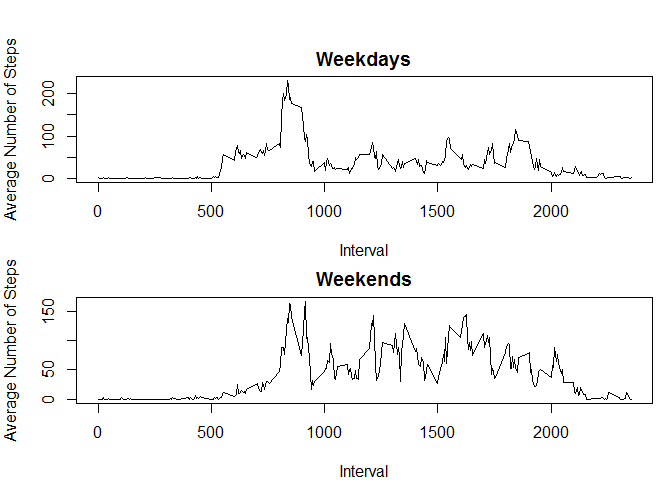

# Reproducible Research: Peer Assessment 1


## Loading and preprocessing the data
Set up the environment, load the required libraries

```r
        setwd("G:/Documents/Coursera/Specialisation in Data Science/05 Reproducible Research/R Working Directory/Project 1/GitHub Repository/RepData_PeerAssessment1")
```

Load the data

```r
        FileName<-"./activity.zip"
        RawDataFile<-unz(FileName,'activity.csv')
        RawData<-read.csv(RawDataFile)
```


Find the NAs and create a data set without them

```r
        SubsetData<-subset(RawData, !is.na(steps), select=c(date,steps,interval))
```


## What is mean total number of steps taken per day?
Total number of steps per day

```r
        DailySteps<-aggregate(SubsetData$steps, list(date=SubsetData$date), sum)
```


Histogram of steps each day

```r
        hist(DailySteps$x)
```

 

Find the mean and median

```r
        MeanSteps<-mean(DailySteps$x)
        MedianSteps<-median(DailySteps$x)
```

The mean number of steps is 1.0766189\times 10^{4} and the median number of steps is 10765.


## What is the average daily activity pattern?
Average number of steps per interval

```r
        IntervalSteps<-aggregate(SubsetData$steps, list(interval=SubsetData$interval), mean)

        plot(IntervalSteps$interval,IntervalSteps$x, type="l", xlab="Interval", ylab="Average Number of Steps")
```

 

```r
        MaxSteps<-max(IntervalSteps$x)
        MaxInterval<-IntervalSteps$interval[IntervalSteps$x==MaxSteps]
```

The maximum number of steps per interval is 206.1698113 and it occurs during interval 835.


## Imputing missing values

Count the NAs

```r
        CountOfNAs<-length(is.na(RawData$steps))
```

There are 17568 NA observations.


Replace the NAs with the mean for that interval

```r
        NewData<-RawData
        NumberOfObservations<-length(RawData$steps)

        for(i in 1:NumberOfObservations) {
                if(is.na(NewData$steps[i])) {
                        NewData$steps[i]<-IntervalSteps$x[IntervalSteps$interval==NewData$interval[i]]
                }
        }
```

Total number of steps per day (with mean figures replacing NAs)

```r
        DailyStepsNewData<-aggregate(NewData$steps, list(date=NewData$date), sum)
```

Histogram of steps each day (with mean figures replacing NAs)

```r
        hist(DailyStepsNewData$x)
```

 

Find the mean and median (with mean figures replacing NAs) and compare to the initial set

```r
        MeanStepsNewData<-mean(DailyStepsNewData$x)
        MedianStepsNewData<-median(DailyStepsNewData$x)

        ComparisonOfMean<-MeanStepsNewData/MeanSteps
        ComparisonOfMedian<-MedianStepsNewData/MedianSteps
```

When the NA values are replaced with the mean for the interval, the mean number of steps is 1.0766189\times 10^{4} and the median number of steps is 1.0766189\times 10^{4}. The new mean is 1 of the calculation without the NAs. The new median is 1.0001104 of the calculation without the NAs.


## Are there differences in activity patterns between weekdays and weekends?
Include a column to show the day of the week for the given date. Also include a column that shows whether the day is a weekday or a weekend.


```r
        NewData$day<-weekdays(as.Date(NewData$date))
        NewData$weekday<-"weekday"
        NewData$weekday[NewData$day=="Saturday"]<-"weekend"
        NewData$weekday[NewData$day=="Sunday"]<-"weekend"
        
        WeekdayData<-subset(NewData, weekday=="weekday", select=c(interval,steps))
        WeekdayIntervalTotals<-aggregate(WeekdayData$steps, list(interval=WeekdayData$interval), mean)

        WeekendData<-subset(NewData, weekday=="weekend", select=c(interval,steps))
        WeekendIntervalTotals<-aggregate(WeekendData$steps, list(interval=WeekendData$interval), mean)
```


Plot the average steps per interval averaged over each weekday and then over each weekend.

```r
        par(mfrow=c(2,1), mar=c(4,4,2,1), oma=c(0,0,2,0))
        plot(WeekdayIntervalTotals$interval,WeekdayIntervalTotals$x, type="l", xlab="Interval", ylab="Average Number of Steps", main="Weekdays")
        plot(WeekendIntervalTotals$interval,WeekendIntervalTotals$x, type="l", xlab="Interval", ylab="Average Number of Steps", main="Weekends")
```

 


